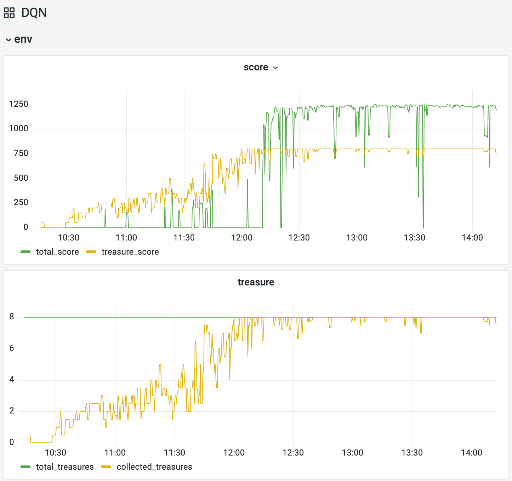
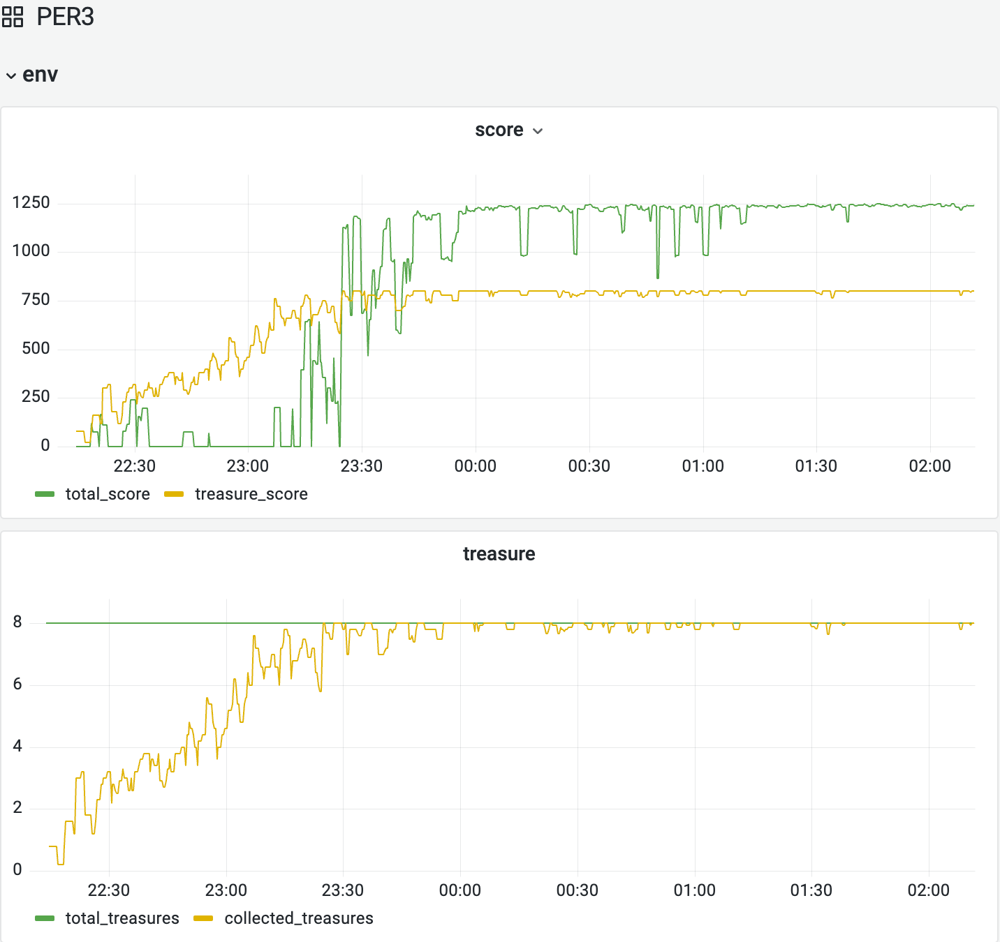
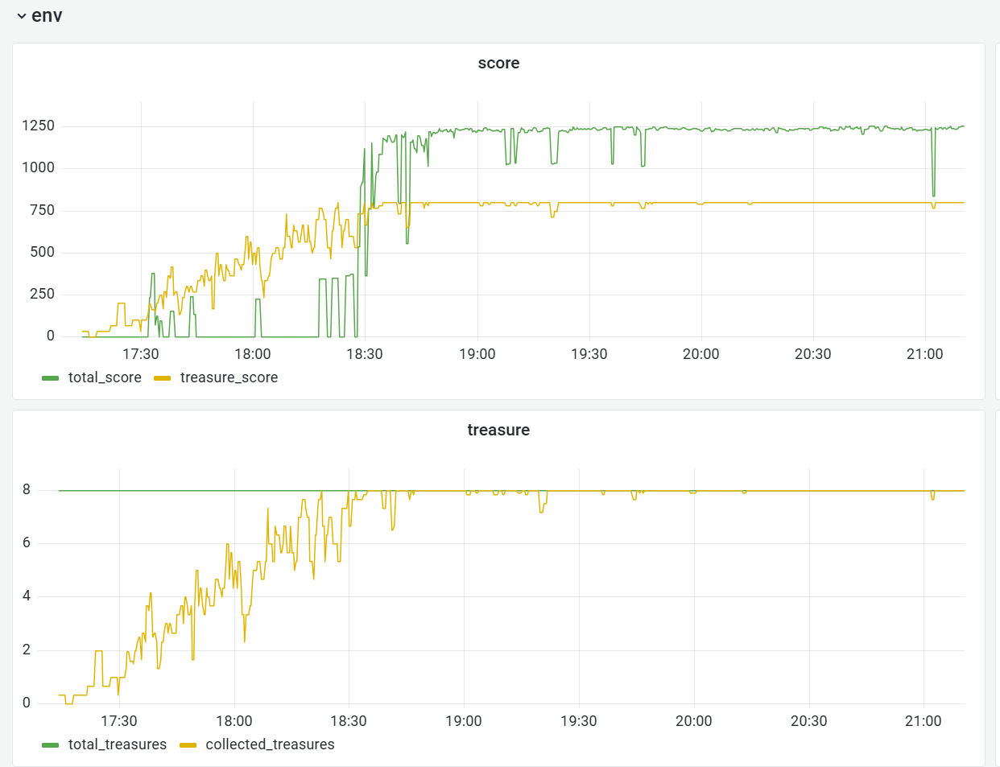
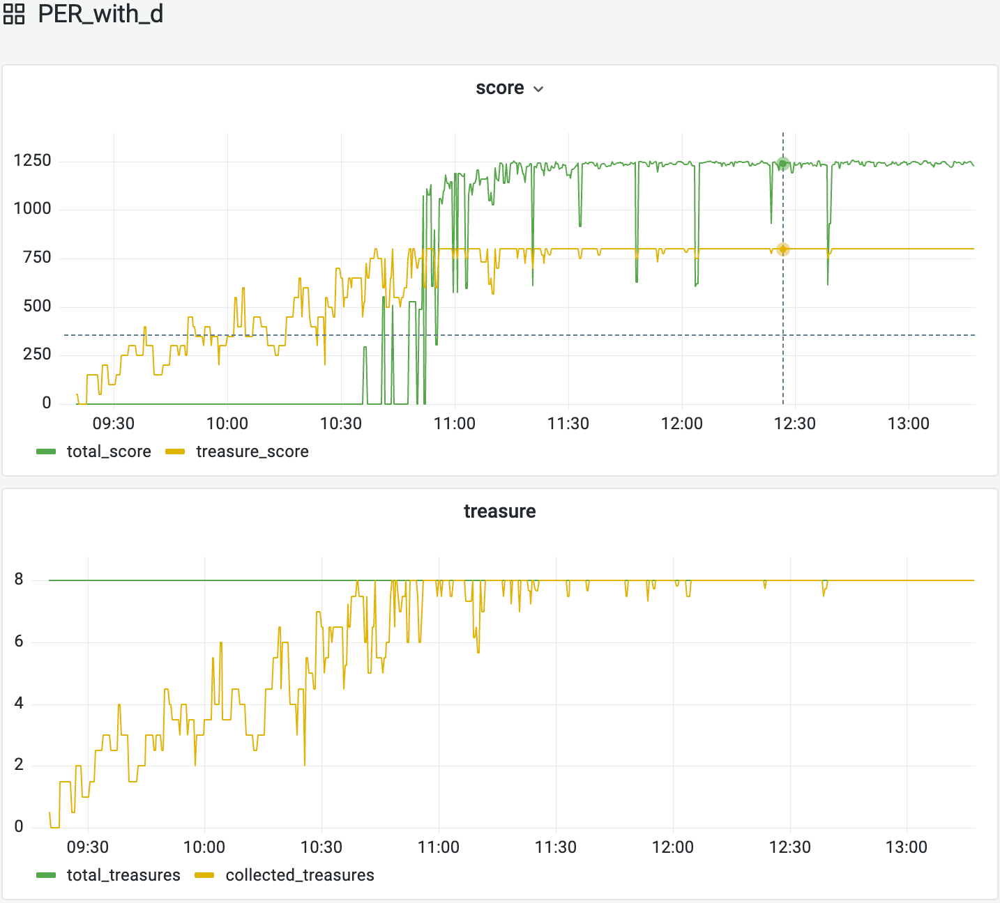
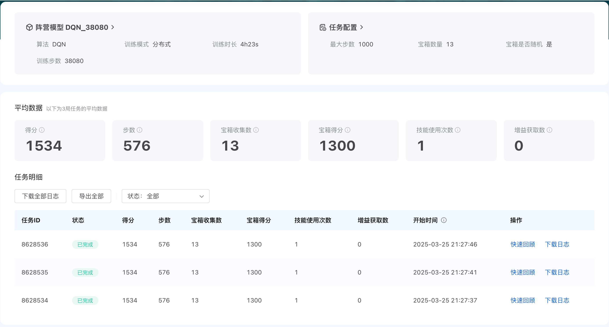
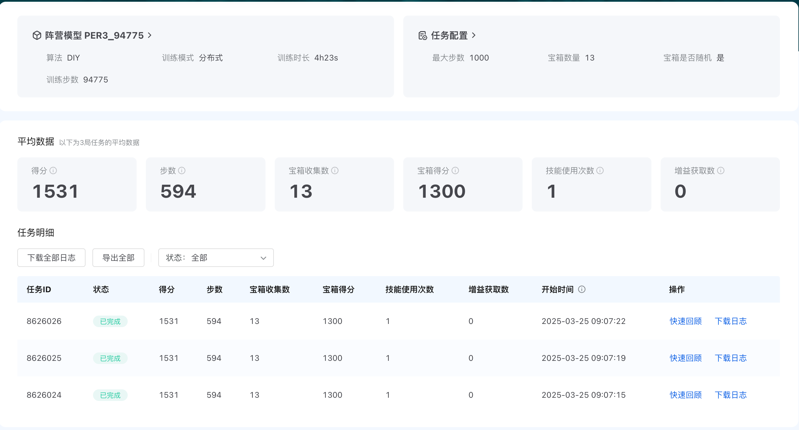
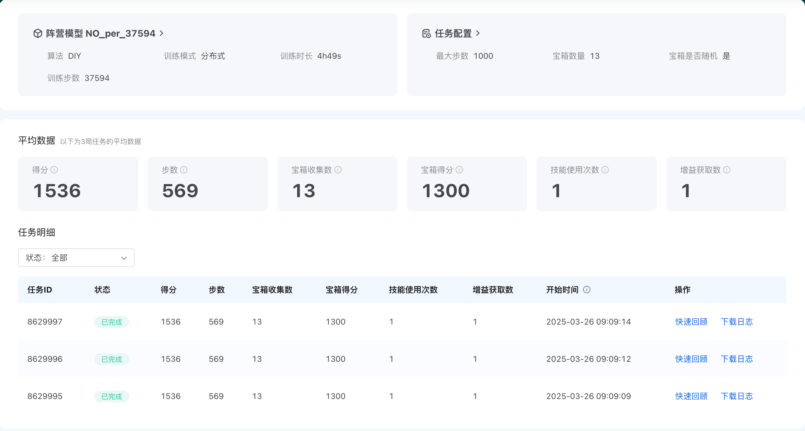
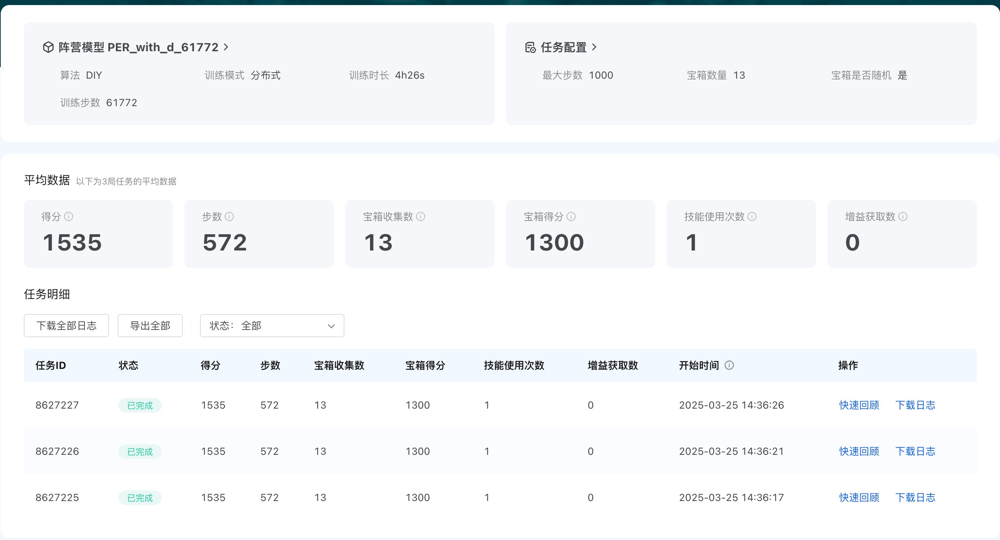

# 训练曲线
## 默认DQN的训练效果

## 加入Prioritized Experience Replay的训练效果

## 加入Double+Dueling DQN的训练效果

## 加入Double+Dueling+PER DQN的训练效果

## 加入N步回报的训练效果
N步回报（N-step Returns）是一种改进的强化学习技术，它使智能体不仅考虑即时奖励，还考虑未来多步的累积奖励。与传统的1步回报相比，N步回报能够让智能体更加注重长期的收益，提高学习效率，特别是在奖励稀疏的环境中。

具体优势：
1. 更快的价值传播：通过直接使用多步奖励的和，价值信息可以更快地传播
2. 减少短视行为：智能体不会过度关注即时奖励，而是考虑到长远利益
3. 提高探索效率：更有效地评估状态价值，有助于探索更有价值的路径

在本项目中，我们使用了3步回报（可在config.py中配置），并结合优先经验回放（PER）一起使用，以获得最佳的训练效果。

# 游戏效果
## 默认DQN的游戏效果

## 加入Prioritized Experience Replay的训练效果

## 加入Double+Dueling DQN的训练效果

## 加入Double+Dueling+PER DQN的训练效果
